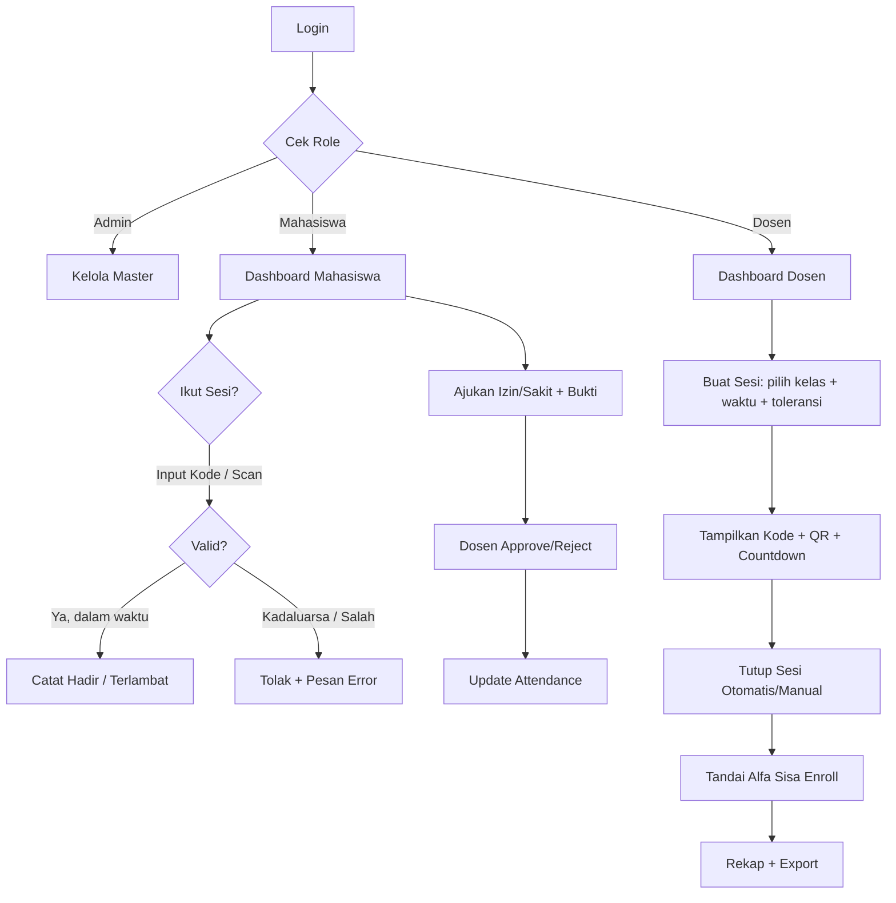
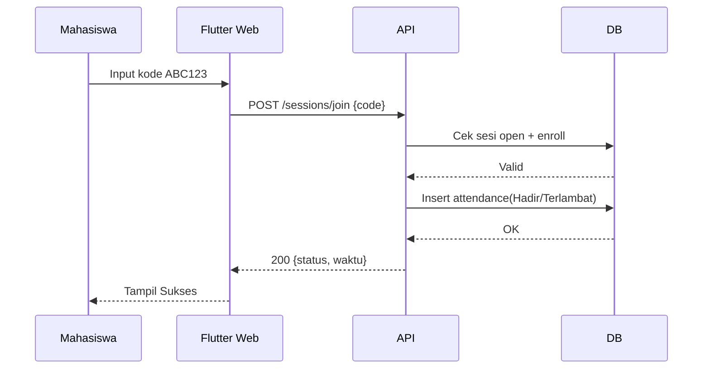
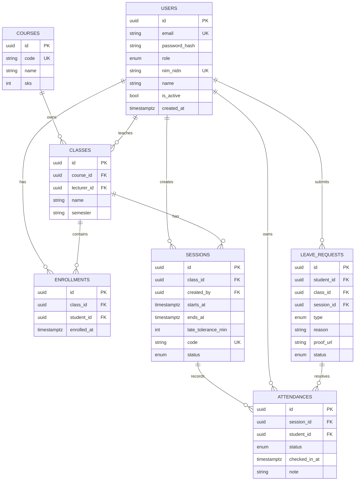
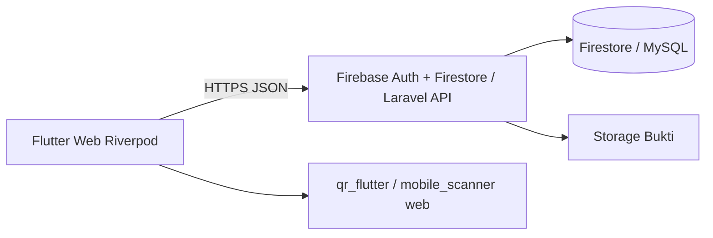

# PRD — Web Absensi Kelas (Flutter Web)

**Versi:** 1.0 MVP
**Tanggal:** 2026-10-01
**Pemilik:** Senior PM / System Analyst
**Status:** Siap implementasi 1 developer

---

## 1. Ringkasan Produk

**Nama:** Web Absensi Kelas
**Visi:** Absensi kelas 30 detik, akurat, teraudit.
**Masalah:**
- Absen manual lambat, mudah dimanipulasi.
- Rekap nilai kehadiran butuh jam kerja.
- Bukti izin/sakit tercecer di chat.
**Tujuan:**
- Dosen buka sesi < 1 menit.
- Mahasiswa absen < 30 detik.
- Rekap + export 1 klik.
- Data kehadiran tunggal, konsisten.

**Indikator sukses MVP:**
- 95% sesi dibuat tanpa error.
- Waktu absen p95 < 30 detik.
- Export Excel/PDF berhasil 99%.

---

## 2. Target Pengguna & Persona

### P1 — Dosen / Guru (Bu Ratna)
- **Kebutuhan:** buka sesi cepat, pantau hadir real-time, rekap nilai.
- **Pain point:** tanda tangan kertas hilang, rekap Excel manual.
- **Sukses:** tutup sesi, rekap otomatis keluar.

### P2 — Mahasiswa / Siswa (Dimas)
- **Kebutuhan:** absen HP/laptop cepat, lihat riwayat + persentase.
- **Pain point:** lupa absen, tidak tahu total alfa, izin via chat.
- **Sukses:** scan/kode, status langsung Hadir, riwayat jelas.

### P3 — Admin Akademik (Pak Budi)
- **Kebutuhan:** kelola user, kelas, mata kuliah, reset akun.
- **Pain point:** data ganda, NIM duplikat, dosen salah input.
- **Sukses:** data master bersih, import massal jalan.

---

## 3. Ruang Lingkup

**In Scope (MVP):**
- [ ] Login email + password, role: admin, dosen, mahasiswa
- [ ] CRUD users, classes, courses, enrollments (admin)
- [ ] Dosen buat/buka/tutup sesi (kode 6 digit + QR, batas waktu)
- [ ] Mahasiswa join via kode / scan QR
- [ ] Status: Hadir, Terlambat, Izin, Sakit, Alfa
- [ ] Pengajuan Izin/Sakit + alasan + upload bukti (max 2MB)
- [ ] Approval dosen
- [ ] Rekap per mahasiswa / kelas / pertemuan
- [ ] Export Excel (wajib), PDF (wajib MVP minimal 1 format)
- [ ] Responsive web, Chrome/Edge/Firefox

**Out of Scope:**
- [ ] Aplikasi mobile native
- [ ] Face recognition / geofencing akurat
- [ ] Integrasi SIAKAD / pembayaran
- [ ] Notifikasi WhatsApp / SMS gateway
- [ ] Multi-bahasa, offline penuh
- [ ] Video conference built-in

---

## 4. User Stories + MoSCoW

| ID | Story | Prioritas |
|----|-------|-----------|
| US-01 | Sebagai dosen, saya ingin membuat sesi absen dengan batas waktu, agar mahasiswa hanya absen saat kelas berlangsung | Must |
| US-02 | Sebagai mahasiswa, saya ingin absen pakai kode/QR, agar tercatat dalam 30 detik | Must |
| US-03 | Sebagai dosen, saya ingin melihat daftar hadir real-time, agar tahu siapa belum absen | Must |
| US-04 | Sebagai mahasiswa, saya ingin melihat riwayat + % kehadiran, agar pantau syarat ujian 75% | Must |
| US-05 | Sebagai mahasiswa, saya ingin ajukan Izin/Sakit + bukti, agar tidak dihitung Alfa | Must |
| US-06 | Sebagai dosen, saya ingin setujui/tolak izin, agar rekap valid | Must |
| US-07 | Sebagai dosen, saya ingin export rekap Excel/PDF, agar disetor ke akademik | Must |
| US-08 | Sebagai admin, saya ingin CRUD user/kelas/matkul, agar data master benar | Must |
| US-09 | Sebagai dosen, saya ingin ubah status manual (koreksi), agar salah input bisa diperbaiki | Should |
| US-10 | Sebagai dosen, saya ingin atur toleransi terlambat (misal 15 mnt), agar fleksibel | Should |
| US-11 | Sebagai admin, saya ingin import CSV mahasiswa, agar input massal cepat | Should |
| US-12 | Sebagai mahasiswa, saya ingin ganti password, agar akun aman | Should |
| US-13 | Sebagai sistem, saya ingin tandai Alfa otomatis setelah sesi tutup, agar tanpa rekap manual | Could |
| US-14 | Sebagai dosen, saya ingin duplikasi sesi minggu lalu, agar hemat waktu | Could |
| US-15 | Sebagai admin, saya ingin log audit perubahan status, agar teraudit | Won't (v2.0) |

---

## 5. Kebutuhan Fungsional

| ID | Fitur | Deskripsi | Prioritas |
|----|-------|-----------|-----------|
| FR-01 | Login & Logout | Email+password, session token 12 jam, logout semua perangkat | Must |
| FR-02 | Role-Based Access | Route guard: `/admin/*`, `/dosen/*`, `/mhs/*`. API cek role tiap request | Must |
| FR-03 | Manajemen Users | CRUD, NIM/NIDN unik, reset password, nonaktifkan | Must |
| FR-04 | Manajemen Courses | CRUD matkul: kode, nama, SKS | Must |
| FR-05 | Manajemen Classes | CRUD kelas: matkul, dosen, semester, enroll mahasiswa | Must |
| FR-06 | Buat Sesi | Dosen pilih kelas, tanggal, jam mulai-selesai, toleransi menit, generate kode 6 digit + QR | Must |
| FR-07 | Tampilkan QR/Kode | QR refresh tiap 60 detik (opsional MVP: statis), countdown waktu | Must |
| FR-08 | Join Sesi | Input kode / scan QR (flutter `qr_code_scanner` web / input manual), 1x absen per sesi | Must |
| FR-09 | Status Otomatis | `<= toleransi` = Hadir, `> toleransi` = Terlambat, lewat tutup = Alfa | Must |
| FR-10 | Koreksi Manual | Dosen ubah status + wajib catatan alasan | Should |
| FR-11 | Izin/Sakit | Form: tipe, tanggal, alasan min 10 char, file jpg/png/pdf max 2MB | Must |
| FR-12 | Approval Izin | Dosen Approve/Reject + catatan, status attendance ikut update | Must |
| FR-13 | Rekap | Tabel per mahasiswa x pertemuan, % hadir, filter kelas/pertemuan | Must |
| FR-14 | Export | Excel (.xlsx) wajib, PDF wajib format tabel sederhana | Must |
| FR-15 | Dashboard | Dosen: sesi aktif, total kelas. Mhs: % kehadiran, sesi hari ini. Admin: total user/kelas | Should |
| FR-16 | Import CSV | Template `nim,nama,email`, validasi duplikat, preview sebelum simpan | Should |
| FR-17 | Profil & Password | Edit nama, ganti password min 8 char | Should |

---

## 6. Kebutuhan Non-Fungsional

| ID | Kategori | Requirement terukur |
|----|----------|---------------------|
| NFR-01 | Performa | LCP < 2.5s di broadband, API p95 < 500ms, dukung 200 user konkuren per kelas 100 |
| NFR-02 | Keamanan | Bcrypt password, HTTPS wajib, rate-limit login 5x/menit, kode sesi acak, validasi file upload |
| NFR-03 | Responsif | 360px–1440px tanpa scroll horizontal, mobile-first untuk halaman absen |
| NFR-04 | Browser | Chrome 110+, Edge 110+, Firefox 115+. QR scan fallback input kode jika kamera ditolak |
| NFR-05 | Aksesibilitas | Kontras WCAG AA, semua tombol bisa keyboard Tab+Enter, label form jelas |
| NFR-06 | Reliabilitas | Uptime target 99.5%, backup DB harian, retry export 1x |
| NFR-07 | Maintainability | Flutter stable, Riverpod/Bloc 1 saja, coverage unit logic absen >70% |
| NFR-08 | Data | Soft-delete, UTC di DB + tampil WIB, audit `created_by/updated_by` |

---

## 7. Alur Pengguna





---

## 8. Wireframe Tekstual

**W-01 Login `/login`:**
- Logo, input email, password + show/hide, tombol Masuk, link Lupa password, error box

**W-02 Dashboard Dosen `/dosen`:**
- Header + role, kartu: Sesi Aktif, Total Kelas, Perlu Approval (badge)
- Tabel sesi hari ini: kelas, jam, kode, sisa waktu, tombol Monitor/Tutup
- Tombol + Sesi Baru

**W-03 Buat Sesi `/dosen/sessions/new`:**
- Dropdown kelas, date picker, time mulai-selesai, number toleransi (default 15), tombol Generate → preview kode + QR

**W-04 Monitor Sesi `/dosen/sessions/:id`:**
- QR besar + kode + countdown, stats Hadir/Terlambat/Izin/Sakit/Alfa/Belum
- Tabel live: foto/nama/NIM, status badge, waktu, aksi koreksi
- Tombol Tutup Sesi (konfirmasi), Export cepat

**W-05 Dashboard Mahasiswa `/mhs`:**
- Kartu % kehadiran global + progress bar 75%, sesi hari ini
- Input kode + tombol Scan QR, riwayat 5 terakhir

**W-06 Riwayat `/mhs/history`:**
- Filter matkul, tabel: tanggal, matkul, status, keterangan, bukti link

**W-07 Izin `/mhs/leave`:**
- Form tipe, rentang tanggal, alasan textarea, upload file, tombol submit, list status Pending/Approved/Rejected

**W-08 Rekap `/dosen/rekap`:**
- Filter kelas + rentang, matriks Mhs x P1..Pn, footer % , tombol Export Excel/PDF

**W-09 Admin `/admin`:**
- Tabs Users/Classes/Courses, tabel + search, tombol Tambah/Edit/Nonaktif, Import CSV

---

## 9. Rancangan Data



**Tabel atribut:**

| Tabel | Kolom kunci | Tipe | Constraint |
|-------|-------------|------|------------|
| users | id, email, nim_nidn, role(admin/dosen/mahasiswa), is_active | uuid, varchar, enum, bool | email UK, nim_nidn UK, idx role |
| courses | id, code, name, sks | uuid, varchar, int | code UK |
| classes | id, course_id, lecturer_id, name, semester | uuid FK | idx course_id, lecturer_id |
| enrollments | id, class_id, student_id | uuid FK | UK(class_id,student_id) |
| sessions | id, class_id, code(6 alnum), starts_at, ends_at, late_tolerance_min default 15, status(open/closed/cancelled) | uuid, varchar, timestamptz | code UK, idx class_id+status |
| attendances | id, session_id, student_id, status(Hadir/Terlambat/Izin/Sakit/Alfa), checked_in_at, note | uuid FK enum | UK(session_id,student_id), idx session_id |
| leave_requests | id, student_id, class_id, session_id nullable, type(Izin/Sakit), reason, proof_url, status(Pending/Approved/Rejected) | uuid FK | idx student_id+status |

---

## 10. Aturan Bisnis

- BR-01: 1 mahasiswa = 1 attendance per session. Duplikat ditolak `409`.
- BR-02: Join hanya saat `status=open AND now() BETWEEN starts_at AND ends_at`.
- BR-03: `checked_in - starts_at <= toleransi` → Hadir, else Terlambat. Default 15 menit, 0–60.
- BR-04: Saat tutup sesi, semua enroll tanpa record → Alfa otomatis.
- BR-05: Syarat ujian: `(Hadir+Terlambat)/total_sesi >= 75%`. Tampil merah jika <75%.
- BR-06: Ubah status hanya dosen pengampu + admin. Mahasiswa tidak bisa edit. Wajib isi `note`.
- BR-07: Izin/Sakit butuh approval dosen. Approved → attendance jadi Izin/Sakit (upsert). Rejected → tetap Alfa/kosong.
- BR-08: Kode 6 digit uppercase alnum tanpa `0/O/1/I`. Unik global sesi open.
- BR-09: Upload bukti max 2MB, jpg/png/pdf saja. Simpan private, akses via signed URL 15 menit.
- BR-10: Sesi closed tidak bisa join/koreksi kecuali dibuka ulang oleh dosen (log audit).
- BR-11: Hapus = soft-delete. Data nilai tidak hilang fisik.

---

## 11. Arsitektur & Tech Stack

**Pilihan MVP: Flutter Web + Firebase (cepat 1 dev). Alternatif: Flutter Web + Laravel REST.**



**Frontend:**
- Flutter 3.22 stable, Dart 3, `flutter_riverpod`, `go_router`, `dio`/`http`, `qr_flutter`, `file_picker`, `excel`, `pdf+printing`, `intl`
- Struktur folder:
```
lib/
  main.dart app.dart
  core/theme router guards utils/
  data/models repositories services/
  features/auth dashboard sessions attendance leave rekap admin/
  widgets/
```

**Backend disarankan:**
- Opsi A (MVP cepat): Firebase Auth + Firestore + Storage + Cloud Functions (auto-Alfa, tutup sesi).
- Opsi B (kampus): Laravel 11 REST + Sanctum + MySQL + S3/MinIO. Koleksi Postman wajib.
- Auth: Bearer JWT, expire 12 jam, refresh 7 hari.

**Hosting:** Firebase Hosting / Vercel (FE), Cloud Run / VPS (BE Laravel).

---

## 12. Rancangan Endpoint API

Base: `/api/v1`. Auth: `Authorization: Bearer <jwt>`

| Method | Path | Deskripsi | Request / Response singkat |
|--------|------|-----------|----------------------------|
| POST | /auth/login | Login | `{email,password}` → `{token,user{role}}` |
| POST | /auth/logout | Logout | `—` → `200` |
| GET | /me | Profil | `—` → `{id,nama,role,%hadir}` |
| GET/POST | /users | List + buat | `?role=&q=` → `{data[],meta}` |
| PUT/DELETE | /users/:id | Ubah/nonaktif | `{name,is_active}` → `200` |
| POST | /users/import | Import CSV | `multipart csv` → `{imported,failed[]}` |
| GET/POST | /courses | List/buat matkul | `{code,name,sks}` |
| GET/POST | /classes | List/buat kelas | `{course_id,lecturer_id,name}` |
| POST | /classes/:id/enroll | Enroll mhs | `{student_ids[]}` → `200` |
| POST | /sessions | Buat sesi | `{class_id,starts_at,ends_at,tolerance}` → `{id,code,qr_payload}` |
| GET | /sessions?class_id=&status=open | List sesi | `—` → `{data[]}` |
| GET | /sessions/:id | Detail + stats | `—` → `{session,stats{hadir...}}` |
| POST | /sessions/:id/close | Tutup + auto-Alfa | `—` → `{closed,alfa_count}` |
| POST | /sessions/join | Absen | `{code}` → `{attendance{status}}` |
| PATCH | /attendances/:id | Koreksi dosen | `{status,note}` → `200` |
| GET | /rekap?class_id= | Matriks rekap | `—` → `{students[],sessions[],matrix}` |
| GET | /rekap/export.xlsx | Export Excel | `?class_id=` → file xlsx |
| GET | /rekap/export.pdf | Export PDF | `?class_id=` → file pdf |
| GET/POST | /leaves | List/ajukan izin | `multipart reason,proof` → `{id,status:Pending}` |
| PATCH | /leaves/:id/approve | Approve | `{note}` → update attendance |
| PATCH | /leaves/:id/reject | Reject | `{note}` → `200` |

Error standar: `{code, message, errors?}`. Kode: 400 validasi, 401 auth, 403 role, 404, 409 duplikat, 422 file.

---

## 13. Kriteria Penerimaan

- [ ] **FR-01 Login:** email salah → 401 pesan jelas. Token kadaluarsa → redirect login. Guard role blokir 403.
- [ ] **FR-06 Buat Sesi:** dosen buat <60 detik, kode unik, QR bisa di-scan, countdown jalan.
- [ ] **FR-08 Join:** kode benar + dalam waktu → Hadir/Terlambat tepat toleransi. Kode salah/kadaluarsa → error spesifik. Double join → 409.
- [ ] **FR-09 Status:** uji batas: tepat 15:00 → Hadir, 15:01 → Terlambat. Tutup sesi → sisa jadi Alfa.
- [ ] **FR-11 Izin:** alasan <10 char ditolak. File >2MB/tipe salah ditolak. Sukses → Pending muncul di dosen.
- [ ] **FR-12 Approval:** Approve Izin → attendance=Izin. Reject → tidak berubah + notif alasan.
- [ ] **FR-13 Rekap:** % = (Hadir+Terlambat)/total*100, 2 desimal. Filter kelas akurat.
- [ ] **FR-14 Export:** Excel terbuka di WPS/Excel, PDF terbaca, nama file `rekap_{kelas}_{tanggal}.xlsx/pdf`.
- [ ] **NFR:** Lighthouse perf >80 desktop, tanpa scroll horizontal 360px, lolos Chrome/Firefox.

---

## 14. Metrik Keberhasilan (KPI)

| KPI | Target MVP (30 hari) | Cara ukur |
|-----|----------------------|-----------|
| Sesi tanpa error | ≥95% | log BE / Firestore |
| Waktu absen p95 | <30 detik | FE analytics timestamp join |
| Dosen aktif mingguan | ≥70% dosen terdaftar | query sessions/creator |
| Mahasiswa absen tepat waktu | ≥85% Hadir | query attendances |
| Export sukses | ≥99% | log download |
| Approval <24 jam | ≥80% | `approved_at-created_at` leaves |
| CSAT dosen/mhs | ≥4.2/5 | survei 1 pertanyaan |
| Crash-free web | ≥99% | Sentry/Firebase Crashlytics |

---

## 15. Risiko & Mitigasi

| Risiko | Dampak | Mitigasi |
|--------|--------|----------|
| Titip absen (share kode/QR foto) | Tinggi | QR rotate 60 detik, toleransi pendek, 1 IP/device flag v1.1, random seat check manual |
| Kamera web gagal scan | Sedang | Fallback input kode manual selalu ada, tombol salin kode |
| Jam server vs client beda | Sedang | Validasi waktu di server saja (UTC), FE hanya tampil |
| Upload bukti besar/gagal | Sedang | Kompresi client, limit 2MB, validasi tipe, retry 1x |
| Data ganda NIM/email | Sedang | UK di DB, preview import, error baris jelas |
| Scope creep (face ID, GPS) | Tinggi | Kunci MVP ini, backlog v2.0, tolak tambah fitur |
| 1 dev overload | Tinggi | Firebase opsi A, potong PDF custom → paket `pdf`, template siap |

---

## 16. Roadmap & Milestone

**MVP (Minggu 1–4) — 1 dev:**
- [ ] W1: Auth + role guard + CRUD master + struktur folder
- [ ] W2: Sesi (buat, kode+QR, join, auto status, tutup+auto Alfa)
- [ ] W3: Izin/Sakit + approval + rekap tabel
- [ ] W4: Export Excel/PDF + polish responsif + UAT 1 kelas + deploy

**v1.1 (Minggu 5–6):**
- [ ] Import CSV, duplikasi sesi, dashboard chart, lupa password email
- [ ] QR rotate, flag device ganda

**v2.0:**
- [ ] Log audit penuh, geofencing opsional, notifikasi email, SIAKAD API, PWA offline, multi-kampus

**Definition of Done MVP:** semua checklist Acceptance lolos, deploy HTTPS, akun demo 3 role, panduan 1 halaman.
